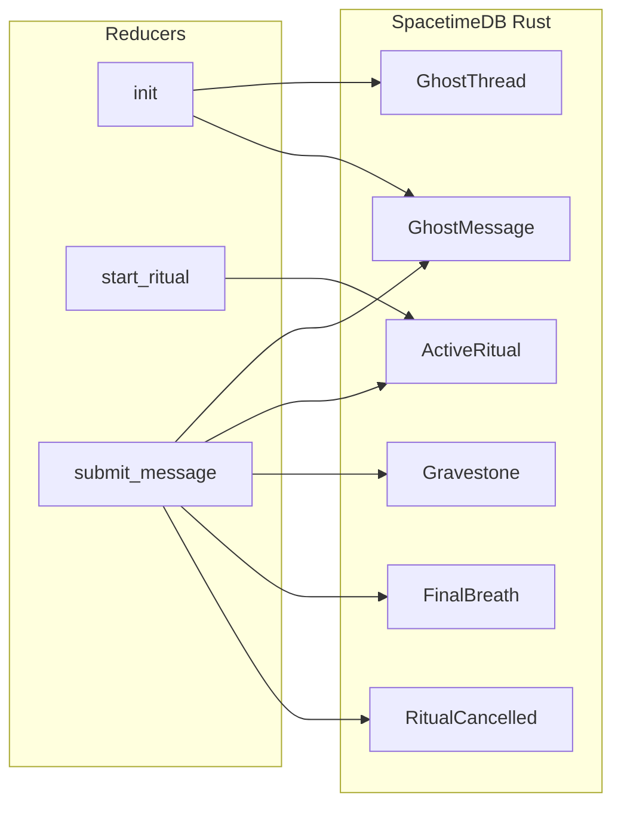
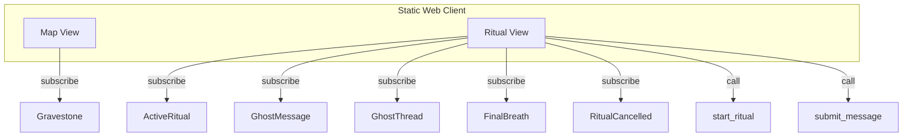

# Aether: The Graveyard of Voices — Exhaustive Implementation Strategy

Single combined plan: seance chatroom implementation plus mise-en-place dev env and CI/deploy. No information from either source plan is dropped.

---

## Overall idea (greater context)

**Aether: The Graveyard of Voices** is an anonymous, real-time social experiment. Users explore a 2D graveyard and enter "séances" to "reanimate" the voices of the past: they talk to **Ghosts**, which are recordings of previous players’ responses. To keep the link alive, each user must reply in a relevant, coherent way; a **stability** score rises or falls with relevance and falls with gibberish. If stability hits zero, the ritual fails (and the client is notified via an event). If the user completes the full exchange, the ritual succeeds and a **Gravestone** appears on the shared map with the thread’s final words. The core mechanic is the **ghost relay**: each new player hears the previous human’s thread and responds to it, so every conversation is a direct reply to a prior player’s thoughts—a "Broken Telephone" through time. The app is a statically hosted web frontend (Next.js, GitHub Pages) talking to a SpacetimeDB 2.0 backend; dev and CI are unified with mise-en-place and repeated type/compile checks.

---

## Current state

- **Backend:** [spacetimedb/src/lib.rs](spacetimedb/src/lib.rs) is a placeholder (Person table, add/say_hello). Uses `spacetimedb` 2.0.2 but 1.0-style attributes (`#[spacetimedb::table(...)]`, `ctx.sender()`). Must be replaced and aligned with 2.0 rules (`#[table(accessor = ..., public)]`, `ctx.sender`, `Table` trait).
- **Bindings:** [src/module_bindings/](src/module_bindings/) holds generated TypeScript; regenerate after schema changes.
- **Frontend:** None yet (no package.json, no index.html, no app). Will be created from scratch as a static site for GitHub hosting.
- **Dev env:** [mise.toml](mise.toml) exists with `"cargo:wasm-opt" = "latest"` only; no Node, no tasks, no CI workflows using mise.

---

## Architecture (high level)

---

## 1. Backend: SpacetimeDB module (Rust)

**File:** [spacetimedb/src/lib.rs](spacetimedb/src/lib.rs)

### 1.1 Schema (2.0 syntax)

Translate [docs/IDEA.md](docs/IDEA.md) schema to SpacetimeDB 2.0 per [.cursor/rules/spacetimedb-rust.mdc](.cursor/rules/spacetimedb-rust.mdc):

- **GhostThread:** `#[table(accessor = ghost_thread, public)]`. Primary key `thread_id: u64` with `#[auto_inc]` (insert with `0`). Fields: `is_complete: bool`, `total_steps: u32`. Add btree index on `is_complete` for `start_ritual` (find complete threads).
- **GhostMessage:** `#[table(accessor = ghost_message, public)]`. Primary key `message_id: u64` with `#[auto_inc]`. Fields: `thread_id: u64`, `step_index: u32`, `text: String`. Add btree index on `thread_id`; add compound index `(thread_id, step_index)` for efficient "ghost message at step" lookup in `submit_message`.
- **Gravestone:** `#[table(accessor = gravestone, public)]`. Primary key `thread_id: u64`. Fields: `x: f32`, `y: f32`, `final_words: String`, `clarity_score: u32`.
- **ActiveRitual:** `#[table(accessor = active_ritual, public)]`. Primary key `user_id: Identity`. Fields: `ancestor_thread_id`, `descendant_thread_id`, `current_step`, `stability: i32`, `x: f32`, `y: f32`.
- **FinalBreath (event):** Event table for successful ritual. `#[table(accessor = final_breath, public)]`. Primary key `id: u64` with `#[auto_inc]`. Fields: `thread_id: u64`, `final_words: String`, `clarity_score: u32`, `timestamp: Timestamp`. Insert on success; clients subscribe and show toast/overlay.
- **RitualCancelled (event):** Event table for stability-failed rituals. `#[table(accessor = ritual_cancelled, public)]`. Primary key `id: u64` with `#[auto_inc]`. Fields: `user_id: Identity`, `timestamp: Timestamp` (optional: `descendant_thread_id: u64`). Insert when stability <= 0 before deleting `ActiveRitual`; clients subscribe and show "Ritual failed / link severed."

Use `use spacetimedb::{table, reducer, Table, ReducerContext, Identity, Timestamp};`. Do **not** derive `SpacetimeType` on table structs. Remove placeholder `Person` and reducers.

### 1.2 Init reducer

- `#[reducer(init)]`: Create "Thread 0" (First Ghost): insert one `GhostThread { thread_id: 0, is_complete: true, total_steps: N }` (with N = 5–10). Insert N `GhostMessage` rows with `thread_id: 0`, `step_index: 0..N-1`, and poetic system messages. Use a fixed `total_steps` (e.g. 5 or 10) and that many seed messages.

### 1.3 start_ritual(x: f32, y: f32)

- Collect all `GhostThread` rows with `is_complete == true` (iterate and filter, or use index if available).
- Use `ctx.rng` to pick one randomly (deterministic).
- Create new descendant thread: insert `GhostThread { thread_id: 0, is_complete: false, total_steps: same as ancestor }`. Capture returned row for `descendant_thread_id`.
- Insert `ActiveRitual { user_id: ctx.sender, ancestor_thread_id, descendant_thread_id, current_step: 0, stability: 100, x, y }`.
- If no complete thread exists, return `Err("No ghost available")` (or similar). Reducer return type: `Result<(), String>`.

### 1.4 submit_message(text: String)

- Find `ActiveRitual` by `ctx.sender`. Return `Err` if none.
- Load ancestor thread's message for current step: query `GhostMessage` by `(thread_id == ancestor_thread_id, step_index == current_step)` (use compound index).
- **Stability logic (deterministic):**
  - Passive decay: subtract 15–20 (e.g. 17) from `stability`.
  - Miasma: for each word, if (>5 consecutive consonants) OR (>15 chars and no vowel), add -20.
  - Relevance: split ghost message and user `text` into words; for each user word, if any ghost word matches (e.g. first 4 chars equal or Levenshtein distance <= 2), add +10. Cap total bonus if needed.
- New stability = max(0, min(100, current + adjustments)).
- Append user message: insert `GhostMessage { thread_id: descendant_thread_id, step_index: current_step, text }`.
- If `stability <= 0`: insert into **RitualCancelled** (e.g. `user_id: ctx.sender`, `timestamp: ctx.timestamp`, optional `descendant_thread_id`); then delete `ActiveRitual`; do **not** mark descendant thread complete. Return `Ok(())`. Clients subscribe to `RitualCancelled` and show "Ritual failed / link severed" (e.g. for matching `user_id` or as global event).
- If `current_step + 1 >= total_steps`: ritual success:
  - Update `GhostThread` for `descendant_thread_id`: set `is_complete: true`.
  - Insert `Gravestone { thread_id: descendant_thread_id, x, y, final_words: text, clarity_score: stability at success }`.
  - Insert `FinalBreath { thread_id, final_words: text, clarity_score, timestamp: ctx.timestamp }`.
  - Delete `ActiveRitual`.
- Else: update `ActiveRitual` with `current_step += 1` and new `stability` (full row update with `..existing`).

Implement Miasma and relevance in pure Rust (no external network). Levenshtein: add a small dependency that works in WASM (e.g. `strsim` or a minimal inline implementation) or use stem match (first 4 chars) only to avoid extra deps.

### 1.5 Event tables (Final Breath & Ritual Cancelled)

- No separate reducers. In `submit_message`: on success, insert into `FinalBreath`; on stability <= 0, insert into `RitualCancelled` then delete `ActiveRitual`. Clients subscribe to both tables and react to inserts (Final Breath: toast/overlay; RitualCancelled: "Ritual failed / link severed").

### 1.6 Index and naming

- Index names must be unique across the module (e.g. `ghost_message_by_thread`, `ghost_message_by_thread_step`, `ghost_thread_by_complete`).

### 1.7 Cargo

- Add dependency for string similarity if used (e.g. `strsim`); ensure it is no_std/WASM-friendly or use a minimal local implementation.

---

## 2. Client: Static web app (Next.js + React)

### 2.1 Scaffold

- Use **Next.js** with React for a SpacetimeDB-compatible frontend and easy static export. SpacetimeDB provides a [Next.js quickstart](https://spacetimedb.com/docs/quickstarts/nextjs); adapt it for **static export** (`output: 'export'` in `next.config.js`) so the app can be hosted on GitHub Pages.
- All SpacetimeDB connection and subscription logic must run **client-side only** (no server-side DB usage when using static export). Use client components and a client-side provider (e.g. `SpacetimeDBProvider` or connection in `useEffect`) to establish `DbConnection`, subscribe in `onConnect` to `Gravestone`, `ActiveRitual`, `GhostMessage`, `GhostThread`, `FinalBreath`, and `RitualCancelled`. Use env vars (e.g. `NEXT_PUBLIC_SPACETIMEDB_URI`) for the database URI.
- Place the app in a `web/` (or `app/`) directory at project root; depend on `spacetimedb` (npm package matching CLI 2.x) and use generated bindings (point to [src/module_bindings/](src/module_bindings/) or copy into `web/` after `spacetime generate`). Set Next.js `basePath` and `assetPrefix` if deploying to a repo subpath (e.g. `/aether-voices/`) on GitHub Pages.

### 2.2 Map View (2D overworld)

- **Canvas:** HTML5 Canvas (or PixiJS if you prefer). Infinite or large 2D plane; camera follows or centers on user "Wisp".
- **Data:** Subscribe to `Gravestone`; render each gravestone at `(x, y)`. Optionally subscribe to `ActiveRitual` to show other users' ritual positions if desired.
- **Wisp:** Cursor/avatar movement (keyboard or mouse); store local position; no need to persist Wisp to DB unless you want multi-user positions later.
- **Proximity echo:** For each gravestone within a radius of Wisp, show "Ghostly Echo" (e.g. tooltip or floating div) with `final_words`. High-contrast terminal style (green/amber on black).

### 2.3 Ritual View (séance chat)

- **Entry:** When user chooses "Start séance" (e.g. button or proximity to a gravestone), call reducer `start_ritual(x, y)` with current Wisp position (or fixed position). On success, open Ritual View.
- **State:** Subscribe to `ActiveRitual`; if current identity has a row, show Ritual View; load `GhostMessage` for ancestor thread (filter by `ancestor_thread_id`, sort by `step_index`) and for descendant thread (same, by `descendant_thread_id`). Display ghost lines and user lines in order; show current ghost message and an input for `submit_message(text)`.
- **UI:** Terminal aesthetic (green/amber on black). Show stability (e.g. bar or number). As stability drops, apply CSS (e.g. blur/skew/flicker) for "weakening signal."
- **Exit:** On ritual fail or success, `ActiveRitual` is removed. Subscribe to `RitualCancelled`; when an insert matches current user (or is global), show "Ritual failed / link severed" and hide Ritual View. On success, show "Final Breath" from `FinalBreath` subscription.

### 2.4 Event feedback (Final Breath and Ritual Cancelled)

- Subscribe to `FinalBreath`; on insert (e.g. `on_insert` or equivalent in 2.0 TS SDK), show a global toast/overlay with the completed ritual's final message (all connected clients see it per [docs/IDEA.md](docs/IDEA.md)). Subscribe to `RitualCancelled`; on insert, show "Ritual failed / link severed" (e.g. toast or modal). If the event includes `user_id`, only show for that user; otherwise treat as global.

### 2.5 Aesthetic and responsiveness

- Global style: high-contrast terminal (green/amber on black). Responsive layout so Map and Ritual are usable on desktop and optionally mobile.

---

## 3. Dev environment: Mise-en-place (tools and tasks)

**File:** [mise.toml](mise.toml)

### 3.1 Tools (unified dev env)

Pin versions so local and CI match. Extend current `[tools]` with:

- **node** — e.g. `"node" = "lts"` or a specific LTS version for the Next.js frontend and `tsc`.
- Keep existing **`"cargo:wasm-opt" = "latest"`**.
- Optionally **rust** — e.g. `"rust" = "stable"` for a pinned Rust version; otherwise rely on system/CI Rust.

### 3.2 Tasks (task management)

Define tasks so one command runs type/compile checks and other common operations. Reference: [mise tasks](https://mise.jdx.dev/tasks/), [task config](https://mise.jdx.dev/tasks/task-configuration.html).

- **check** — Run Rust and TypeScript type/compile checks repeatedly (for local use and CI):
  - `cargo check` (from repo root or from `spacetimedb/` depending on Cargo workspace layout).
  - `tsc --noEmit` for the frontend (run from `web/` or where `tsconfig.json` lives). Use `tsc --noEmit` (standard TypeScript flag for type-check without emitting); user originally said "no-edit" — same intent.
  - Use mise task syntax (e.g. `run = ["cargo check", "tsc --noEmit"]` in a single task, or separate tasks with a `check` task that depends on both). Run locally with `mise run check`.
  - Until the frontend exists, the `check` task can run only `cargo check`, or a no-op for TS.
- **build** (optional) — Build SpacetimeDB module + frontend.
- **test** (optional) — Run tests if added later.

Ensure the repo root has [mise.toml](mise.toml); frontend lives under `web/` with its own `package.json` and `tsconfig.json`.

---

## 4. Bindings and deployment

- After backend changes: run `spacetime generate --lang ts --out-dir <frontend>/src/module_bindings --module-path spacetimedb` (e.g. `web/src/module_bindings` if app lives in `web/`).
- **GitHub hosting:** Next.js static export outputs to `out/` (default for `output: 'export'`). Configure GitHub Actions to deploy `out/` to GitHub Pages (e.g. `peaceiris/actions-gh-pages` with `publish_dir: out`). Set `NEXT_PUBLIC_SPACETIMEDB_URI` in repo secrets for production. The deploy workflow must use mise (see section 5.2).

---

## 5. GitHub Actions (CI and deploy) — use mise everywhere

Use mise in CI so the same tools and tasks run in the cloud. One source of truth ([mise.toml](mise.toml)) for tools and tasks; same commands locally and in CI.

### 5.1 Install mise in workflows

Use [jdx/mise-action@v3](https://github.com/jdx/mise-action) with:

- `install: true` — runs `mise install` and installs tools from [mise.toml](mise.toml).
- `cache: true` — enables caching for speed.

### 5.2 CI workflow (type/compile checks, run repeatedly)

Add a **CI workflow** (e.g. [.github/workflows/ci.yml](.github/workflows/ci.yml)) that runs on **push** and **pull_request**:

1. Checkout repo.
2. Run `jdx/mise-action` (install: true, cache: true).
3. Run `mise run check` (or equivalent: `mise exec -- cargo check` and `mise exec -- tsc --noEmit` if not using a task).

This runs `cargo check` and `tsc --noEmit` on every push and PR — i.e. repeatedly.

### 5.3 Deploy workflow (GitHub Pages)

The workflow that deploys to GitHub Pages must **also use mise**:

1. Checkout repo.
2. Run `jdx/mise-action` before building the Next.js app so Node and env are consistent with local and CI.
3. Run the frontend build (e.g. `mise run build` or `npm run build` / `pnpm build` after `mise install`).
4. Deploy `out/` (e.g. `peaceiris/actions-gh-pages` with `publish_dir: out`).

---

## 6. Where to run what

| What | Where |
|------|--------|
| `cargo check` | SpacetimeDB module (repo root or `spacetimedb/` depending on Cargo workspace layout). |
| `tsc --noEmit` | Frontend only (e.g. `web/` with its `tsconfig.json`); run after frontend exists. Until then, the `check` task can run only `cargo check`, or a no-op for TS. |

---

## 7. Implementation order (single exhaustive list)

1. **Mise and CI (early)** — Update [mise.toml](mise.toml) with Node (and optionally Rust); add task `check` (cargo check + tsc --noEmit; TS part no-op or skipped until frontend exists). Add [.github/workflows/ci.yml](.github/workflows/ci.yml) using `jdx/mise-action`, running `mise run check` on push and pull_request. Ensure the deploy workflow (when added in step 10) uses mise for the build step.
2. **Backend schema and init** — Define all 6 tables (GhostThread, GhostMessage, Gravestone, ActiveRitual, FinalBreath, RitualCancelled) in 2.0 syntax in [spacetimedb/src/lib.rs](spacetimedb/src/lib.rs), remove Person, implement `init` and seed Thread 0.
3. **start_ritual and submit_message** — Implement both reducers with stability and Miasma/relevance; on success insert `FinalBreath`; on stability <= 0 insert `RitualCancelled` then delete `ActiveRitual`.
4. **Regenerate bindings** — Run `spacetime generate` and point frontend at bindings (e.g. `web/src/module_bindings`).
5. **Frontend scaffold** — Next.js (React) in `web/` with `output: 'export'`, client-only SpacetimeDB connection, subscribe to all tables including RitualCancelled. Add `tsconfig.json` so `mise run check` can run `tsc --noEmit` from `web/`.
6. **Map View** — Canvas, Gravestone subscription, Wisp movement, proximity echo.
7. **Ritual View** — start_ritual call, load messages, submit_message call, stability UI and decay styling.
8. **Event UIs** — Subscribe to `FinalBreath` and `RitualCancelled`; toast/overlay for Final Breath, "Ritual failed" feedback for RitualCancelled.
9. **Update check task** — Ensure `mise run check` runs both `cargo check` and `tsc --noEmit` (from `web/`) now that frontend exists.
10. **GitHub Pages deploy** — Add deploy workflow using `jdx/mise-action`, then `mise run build` (or npm/pnpm build), then deploy `out/` to GitHub Pages (e.g. `peaceiris/actions-gh-pages`, `publish_dir: out`). Set `NEXT_PUBLIC_SPACETIMEDB_URI` in repo secrets for production.

---

## 8. Decisions and notes

- **Stability constants:** Passive decay 17; Miasma -20 per word; Relevance +10 per matching word. Tune in implementation if needed.
- **First Ghost (Thread 0):** `total_steps` and seed messages count (e.g. 5 or 10) defined in `init`; same `total_steps` used when creating descendant threads in `start_ritual`.
- **No auth beyond Identity:** Anonymous; `ctx.sender` is the only identity. No usernames unless you add them later.
- **Crate edition:** Use Rust edition 2024 only. Keep [spacetimedb/Cargo.toml](spacetimedb/Cargo.toml) with `edition = "2024"`; do not fall back to 2021.
- **TypeScript check:** Use `tsc --noEmit` for type-check without emitting.
- **Repeated checks:** Rust and TypeScript type/compile checks run in CI on every push/PR and locally via `mise run check`.
